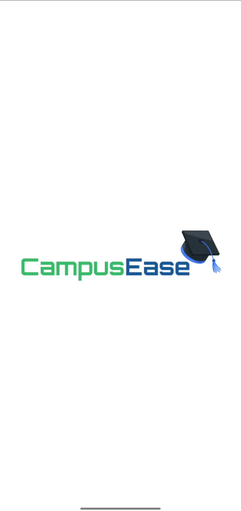
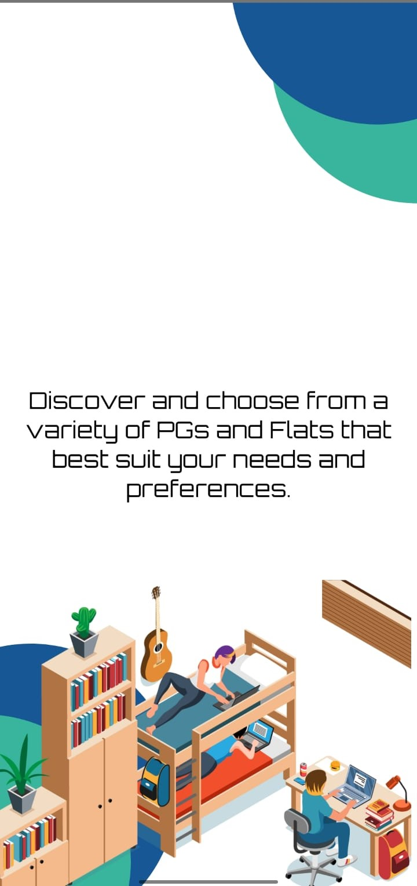
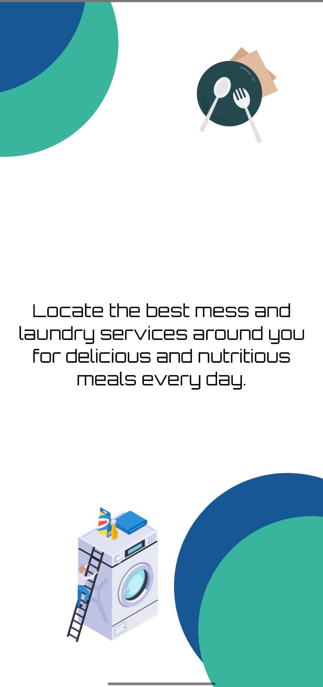
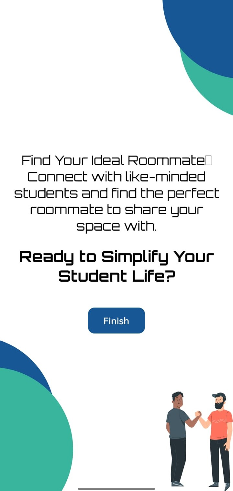
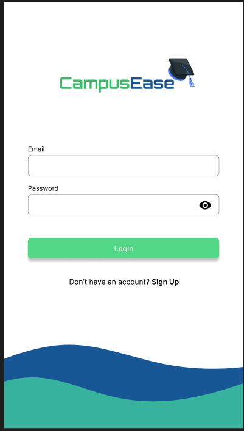
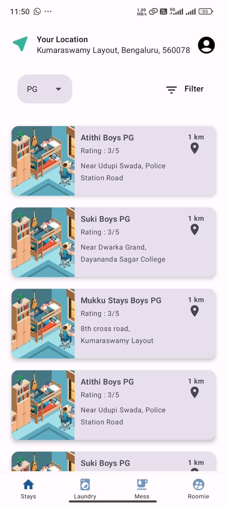
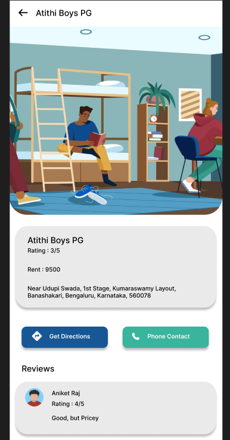

# CampusEaze

CampusEase is an application designed to assist students in finding nearby PGs, flats, laundry services, mess, cook facilities, and roommates. The app offers an intuitive, user-friendly interface built with Jetpack Compose and follows the MVVM architecture. It efficiently manages API calls using Retrofit to provide a seamless experience for accessing essential student services.

## Features

- Roommate Finder: Matches students with potential roommates based on shared interests.
- Nearby Services: Easily discover PGs, flats, laundry, and mess services near you.
- Real-time Updates: Get the latest availability and pricing information with fast API responses via Retrofit.
- User-friendly UI: Simple and intuitive design using Jetpack Compose for smooth navigation.

## Documentation References

1. **Jetpack Compose**: Official documentation for building Android UIs.
    [Jetpack Compose Documentation](https://developer.android.com/develop/ui/compose/kotlin)

2. **MVVM Architecture**: Guide to implementing the Model-View-ViewModel (MVVM) pattern in Android.
    [MVVM Architecture ](https://developer.android.com/topic/libraries/architecture/viewmodel)

3. **Retrofit**: Reference for integrating Retrofit to manage API calls.
    [Retrofit Documentation](https://square.github.io/retrofit/)

4. **Firebase Authentication**: Documentation for implementing Firebase Authentication in Android.
    [Firebase Documentation](https://firebase.google.com/docs/auth)

    
## Screenshots

Here are some screenshots from the app:

<table>
  <tr>
    <td></td>
    <td></td>
    <td></td>
  </tr>
  <tr>
    <td></td>
    <td></td>
    <td></td>
  </tr>
  <tr>
    <td></td>
    <td></td>
    <td></td>
  </tr>
</table>

